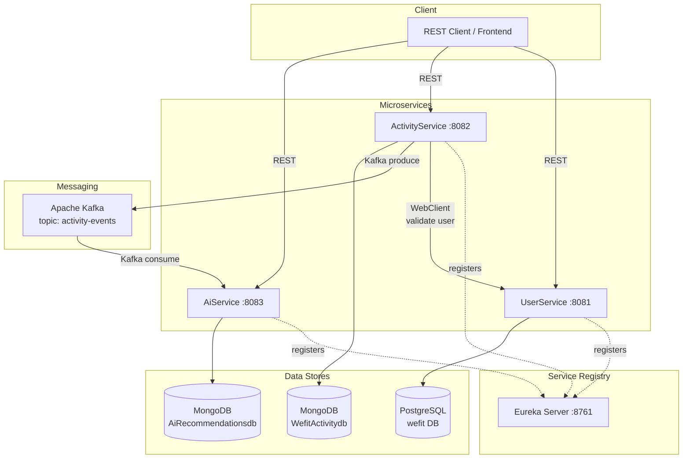

# WeFit — Architecture

## High-Level Architecture

WeFit follows a **microservices architecture** with event-driven communication via Kafka and synchronous inter-service calls via load-balanced WebClient.



## Communication Patterns

### 1. Synchronous — WebClient (ActivityService → UserService)

When an activity is submitted, `ActivityService` validates the user by calling `UserService` synchronously via **WebClient** pointing directly at `http://localhost:8081`.

> ⚠️ **Eureka is optional for local dev.** The original `@LoadBalanced` WebClient using `http://userService`
> caused `Invalid user` errors when Eureka wasn't running. Now uses a direct configurable URL:
> `${user-service.base-url:http://localhost:8081}`.

```
ActivityController.addActivity()
  └─→ ActivityService.addActivity()
       └─→ UserValidationService.validateUser(userId)
            └─→ WebClient GET http://localhost:8081/api/user/auth/{userId}/validate
                 └─→ AuthController.validateUser() on UserService
```

**Configuration** ([WebClientConfig.java](file:///c:/Wefit/activityService/src/main/java/com/wefit/activityService/config/WebClientConfig.java)):
- Direct URL: `http://localhost:8081` (configurable via `user-service.base-url` property)
- No `@LoadBalanced` — works without Eureka

### 2. Asynchronous — Kafka (ActivityService → AiService)

After saving an activity, `ActivityService` publishes the activity data to the `activity-events` Kafka topic. `AiService` consumes this event and generates a recommendation.

```
ActivityService saves Activity to MongoDB
  └─→ [Kafka Producer] topic: activity-events
       └─→ [Kafka Consumer] ActivityMessageListener.listen()
            └─→ RecommendationService.generateRecommendation()
                 └─→ Save Recommendation to MongoDB
```

**Kafka Configuration:**

| Property | Producer (ActivityService) | Consumer (AiService) |
|----------|---------------------------|----------------------|
| Topic | `activity-events` | `activity-events` |
| Group ID | — | `activity-processor-group` |
| Key Serializer | `StringSerializer` | `StringDeserializer` |
| Value Serializer | `JsonSerializer` | `JsonDeserializer` |
| Trusted Packages | — | `*` (all) |
| Default Type | — | `com.wefit.aiService.entities.Activity` |
| Type Headers | `false` | `false` |

### 3. Service Discovery — Eureka

All services register with Eureka at `http://localhost:8761/eureka`. The Eureka server itself does NOT register with itself (`register-with-eureka: false`, `fetch-registry: false`).

## Service Architecture Details

### Eureka Server
- Standalone Spring Cloud Netflix Eureka server
- No business logic; pure infrastructure concern
- Port: 8761

### UserService
- **Pattern**: Controller → Service → Repository → PostgreSQL
- **ORM**: Spring Data JPA + Hibernate
- **DDL Strategy**: `hibernate.ddl-auto: update` (auto-schema evolution)
- **Validation**: Jakarta Bean Validation (`@NotBlank`, `@Email`)
- **No security layer** (no Spring Security, no password hashing)

### ActivityService
- **Pattern**: Controller → Service → Repository → MongoDB
- **Cross-service call**: WebClient → UserService (user validation)
- **Event publishing**: Kafka producer (activity-events topic)
- **MongoDB auditing**: Enabled via `@EnableMongoAuditing` in [MongoConfigurations.java](file:///c:/Wefit/activityService/src/main/java/com/wefit/activityService/config/MongoConfigurations.java)

### AiService
- **Pattern**: Kafka Consumer → Service → Repository → MongoDB
- **REST API**: Exposes GET endpoints for retrieving recommendations
- **AI Integration**: Calls **Google Gemini API** via `RestClient` (Spring Boot 4 synchronous HTTP client)
  - Uses `RestClient` instead of `WebClient` to avoid `NotSslRecordException` on Windows/JDK21
  - Gemini API key configured via `${GEMINI_API_KEY}` environment variable / `.env`
  - Falls back to a static recommendation message if Gemini is unavailable
- **Kafka listener**: [ActivityMessageListener.java](file:///c:/Wefit/aiService/src/main/java/com/wefit/aiService/service/ActivityMessageListener.java)
- **AI service**: [GeminiService.java](file:///c:/Wefit/aiService/src/main/java/com/wefit/aiService/service/GeminiService.java)

## Layered Architecture (per service)

```
┌─────────────────────────────────┐
│         Controller Layer        │  REST endpoints (@RestController)
├─────────────────────────────────┤
│          DTO Layer              │  Request/Response DTOs
├─────────────────────────────────┤
│         Service Layer           │  Business logic (@Service)
├─────────────────────────────────┤
│       Repository Layer          │  Data access (Spring Data)
├─────────────────────────────────┤
│         Entity Layer            │  Domain model (@Entity / @Document)
├─────────────────────────────────┤
│        Config Layer             │  Configuration (@Configuration)
└─────────────────────────────────┘
```

## Port Allocation

| Service         | Port |
|-----------------|------|
| Eureka Server   | 8761 |
| UserService     | 8081 |
| ActivityService | 8082 |
| AiService       | 8083 |
| Kafka Broker    | 9092 |
| MongoDB         | 27017 |
| PostgreSQL      | 5432 |

## Startup Order

Eureka is optional for local development (services communicate via direct URLs).
For full service-discovery mode, start in this order:

1. **Eureka Server** (wait 30s) — optional
2. **UserService** (wait 15s) — needed by ActivityService for user validation
3. **ActivityService** (wait 15s) — publishes to Kafka
4. **AiService** — consumes from Kafka, calls Gemini API

**Quick start without Eureka** (recommended for local dev):
```powershell
# Load .env first, then start each service
Get-Content c:\Wefit\.env | ForEach-Object {
    if ($_ -match '^([^#=]+)=(.*)$') {
        [Environment]::SetEnvironmentVariable($matches[1].Trim(), $matches[2].Trim(), "Process")
    }
}
# Start each in its own terminal: cd <service> && ./mvnw.cmd spring-boot:run
```
