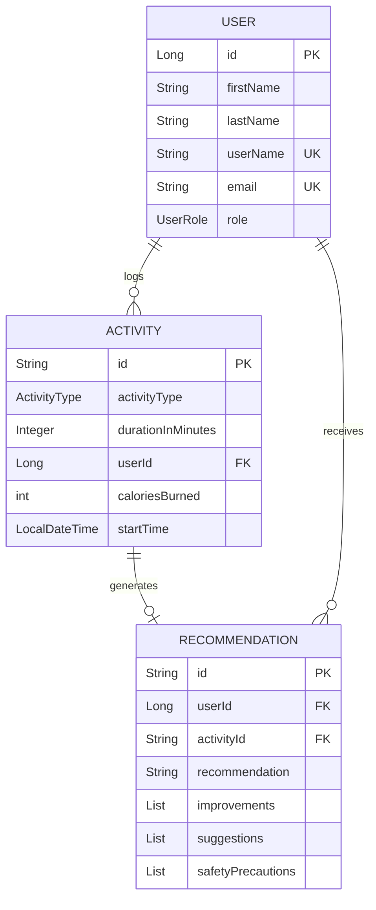

# WeFit — Business Domain

## Domain Overview

WeFit operates in the **health & fitness technology** domain. It is a platform that:

1. **Manages user accounts** — registration, profiles, roles
2. **Tracks fitness activities** — logging workouts with metrics
3. **Generates AI recommendations** — personalized suggestions based on activity data

## Core Domain Concepts

### User

A registered platform user who logs fitness activities and receives recommendations.

| Attribute        | Type           | Rules                              |
|-----------------|----------------|-------------------------------------|
| firstName       | String         | Required                            |
| lastName        | String         | Required                            |
| userName        | String         | Required, unique                    |
| email           | String         | Required, unique, valid email       |
| password        | String         | Required (currently plaintext)      |
| phoneNumber     | String         | Optional                            |
| bio             | String         | Optional                            |
| gender          | String         | Optional (free text, not enum)      |
| dateOfBirth     | String         | Optional (stored as String)         |
| profilePicUrl   | String         | Optional                            |
| role            | UserRole       | Defaults to USER                    |

### User Roles

```java
enum UserRole { USER, ADMIN, COACH }
```

- **USER** — Default role; end-user who logs activities
- **ADMIN** — Administrative role (not yet enforced anywhere)
- **COACH** — Coaching role (not yet enforced anywhere)

> **Note**: Roles are stored but have no authorization enforcement. There is no role-based access control.

### Activity

A fitness workout session logged by a user.

| Attribute          | Type                 | Rules                        |
|-------------------|----------------------|-------------------------------|
| activityType      | ActivityType         | Enum value                    |
| durationInMinutes | Integer              | Workout duration              |
| userId            | Long                 | FK to User (validated via API)|
| caloriesBurned    | int                  | Calories burned               |
| startTime         | LocalDateTime        | When the activity started     |
| additionalMetrics | Map<String, Object>  | Flexible key-value metrics    |

### Activity Types

```java
enum ActivityType {
    RUNNING, WALKING, CYCLING, SWIMMING, YOGA,
    MEDITATION, HIIT, STRENGTH_TRAINING, CARDIO,
    FLEXIBILITY, OTHER
}
```

### Recommendation

An AI-generated recommendation based on a completed activity.

| Attribute          | Type           | Description                        |
|-------------------|----------------|------------------------------------|
| userId            | Long           | The user this recommendation is for |
| activityId        | String         | The activity that triggered this    |
| recommendation    | String         | Main recommendation text            |
| improvements      | List<String>   | Suggested improvements              |
| suggestions       | List<String>   | Next-step suggestions               |
| safetyPrecautions | List<String>   | Safety tips                         |

## Business Rules

### User Registration
1. Email must be unique — duplicate email registration throws `RuntimeException("Email already exists")`
2. Role defaults to `USER` if not provided
3. Timestamps (`createdDateTime`, `updadatedDateTime`) are set at creation time
4. No password strength requirements enforced
5. No email verification flow

### Activity Logging
1. User must exist — validated via synchronous REST call to UserService
2. If user validation fails (user not found OR UserService unreachable), the activity is rejected with `RuntimeException("Invalid user")`
3. Activity is persisted to MongoDB with auto-generated `String` ID
4. After save, activity data is published to Kafka for async recommendation generation

### Recommendation Generation
1. Triggered asynchronously by Kafka consumer upon receiving activity events
2. Currently generates **hardcoded placeholder** recommendations (not actual AI)
3. One recommendation per activity (linked by `activityId`)
4. Users can retrieve their last 5 recommendations (most recent first)

## Domain Relationships



## Bounded Contexts

| Context            | Service         | Owns                          |
|--------------------|-----------------|-------------------------------|
| Identity & Access  | UserService     | User, UserRole                |
| Activity Tracking  | ActivityService | Activity, ActivityType        |
| AI Insights        | AiService       | Recommendation                |

## Data Flow: End-to-End User Journey

```
1. User registers         →  POST /api/user/auth/register  →  PostgreSQL
2. User logs activity     →  POST /api/activities/add
   2a. Validate user      →  GET /api/user/auth/{id}/validate (sync)
   2b. Save activity      →  MongoDB (WefitActivitydb)
   2c. Publish event      →  Kafka (activity-events topic)
3. AI generates reco      →  Kafka consumer → MongoDB (AiRecommendationsdb)
4. User fetches recos     →  GET api/recommendations/user/{userId}
```
