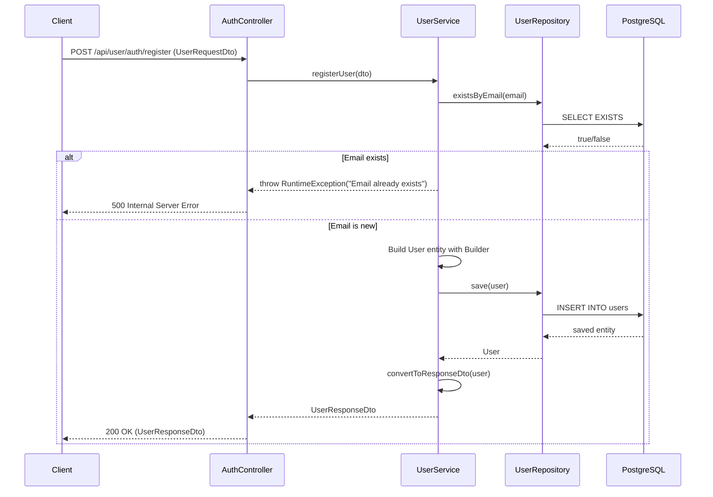
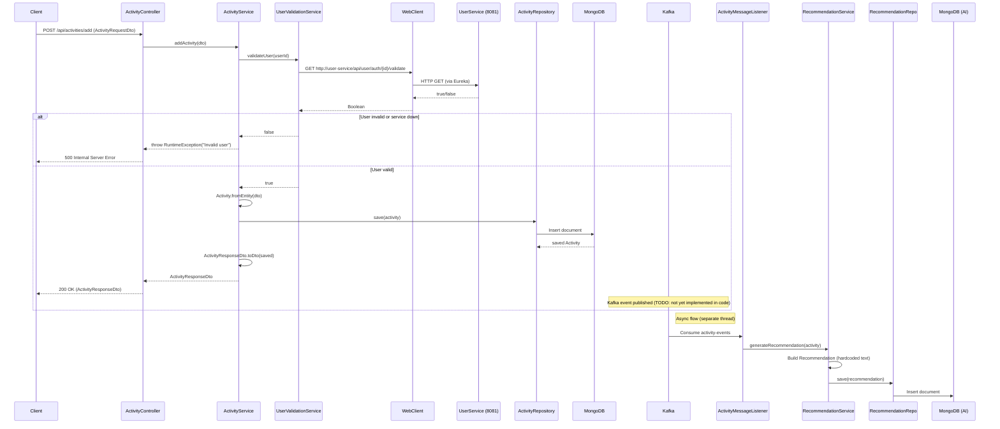
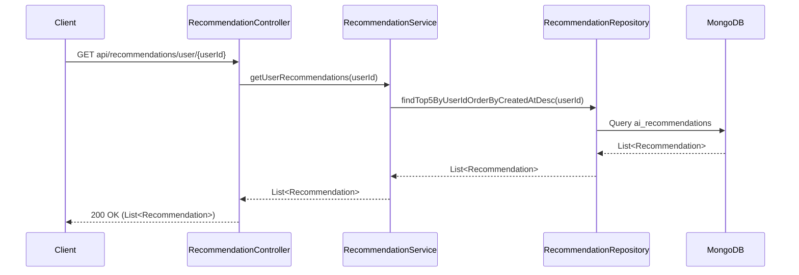
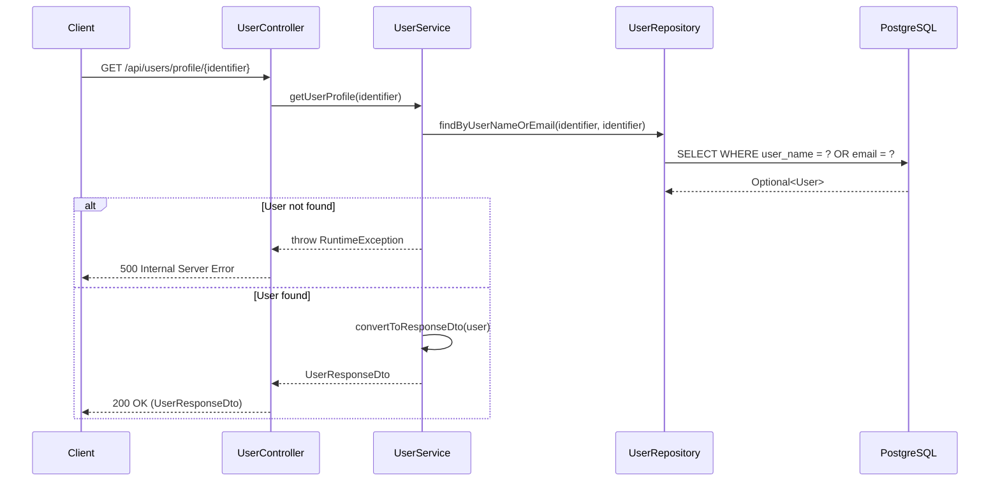

# WeFit — Workflows

## Core Business Workflows

### 1. User Registration Flow



**Key files**:
- [AuthController.java](file:///c:/Wefit/userService/src/main/java/com/wefit/userService/controller/AuthController.java)
- [UserService.java](file:///c:/Wefit/userService/src/main/java/com/wefit/userService/service/UserService.java)

---

### 2. Activity Logging Flow (with Kafka)



> **Important observation**: The ActivityService has Kafka producer dependencies and configuration, but the actual `KafkaTemplate.send()` call is **not yet implemented** in `ActivityService.java`. The Kafka producer publish step is missing from the current code. The consumer (AiService) is fully wired.

**Key files**:
- [ActivityController.java](file:///c:/Wefit/activityService/src/main/java/com/wefit/activityService/controller/ActivityController.java)
- [ActivityService.java](file:///c:/Wefit/activityService/src/main/java/com/wefit/activityService/service/ActivityService.java)
- [UserValidationService.java](file:///c:/Wefit/activityService/src/main/java/com/wefit/activityService/service/UserValidationService.java)
- [ActivityMessageListener.java](file:///c:/Wefit/aiService/src/main/java/com/wefit/aiService/service/ActivityMessageListener.java)
- [RecommendationService.java](file:///c:/Wefit/aiService/src/main/java/com/wefit/aiService/service/RecommendationService.java)

---

### 3. Recommendation Retrieval Flow



---

### 4. User Profile Lookup Flow



---

## Startup Workflow

Two scripts are provided for starting all services in the correct order:

### Windows Batch ([start-services.bat](file:///c:/Wefit/start-services.bat))
### Python Cross-Platform ([start_services.py](file:///c:/Wefit/start_services.py))

```
1. Start Eureka Server     → Wait 30 seconds
2. Start UserService       → Wait 15 seconds
3. Start ActivityService   → Wait 15 seconds
4. Start AiService         → No wait (last service)
```

Each service is started in its own console window via `mvnw.cmd spring-boot:run`.

## Development Workflow

1. Ensure infrastructure is running: PostgreSQL (5432), MongoDB (27017), Kafka (9092)
2. Run `start-services.bat` or `python start_services.py` from the project root
3. Verify Eureka dashboard at `http://localhost:8761`
4. Test APIs via REST client (Postman, curl, etc.)
