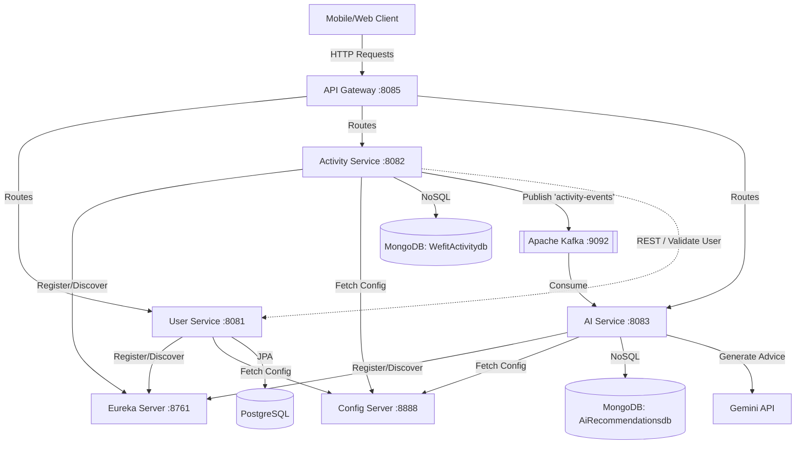

# 🏋️ Wefit — AI-Powered Social Fitness Platform
[](#system-architecture)
[](https://adoptium.net/)
[](https://spring.io/projects/spring-boot)
[](https://kafka.apache.org/)
[](https://ai.google.dev/)
**Wefit** is an AI-powered fitness ecosystem built using Spring Cloud Microservices. The platform allows users to log workouts, track key physical metrics, and receive instant, personalized training and nutrition recommendations powered by Google's Gemini AI. 
Our ultimate vision is to evolve Wefit into a **vibrant social media fitness platform** where tracking workouts is social, collaborative, and engaging.
---
## 🌟 The Vision: Social Media Fitness Platform
We want to bridge the gap between individual workout logging and social accountability. Wefit is moving towards a community-first social fitness network:
1. **Fitness Feed**: A home feed where users can share their logged workouts, activities, and AI recommendations with their network.
2. **Social Interaction**: Enable users to follow friends, comment on workout achievements, and cheer each other on using custom reactions (e.g., "Sweat", "Fire", "Strong").
3. **Group Challenges**: Create and join fitness challenges (e.g., "10k steps for 30 days" or "Weekly 50km Cycling") with real-time leaderboards.
4. **AI-Enhanced Sharing**: Users can post their personalized Gemini training plans and nutritional tips directly to their profile or feed to help others.
5. **Coach Integration**: Coaches can create custom workouts, offer feedback, and view their clients' logs directly within the social ecosystem.
---
## 🛠️ What has been done so far
We have built a robust backend foundation using a **Spring Cloud Microservice architecture** with event-driven synchronization:
### 1. Core Platform Infrastructure
*   **Centralized Configuration (`configServer` - Port `8888`)**: Serves environment-specific configuration values to all microservices dynamically.
*   **Service Discovery (`eureka` - Port `8761`)**: A registry server where all microservices register themselves, enabling dynamic service lookup and load balancing.
*   **API Gateway (`apiGateway` - Port `8085`)**: Act as a reverse proxy, routing incoming client requests to their appropriate services via Eureka load balancing (`lb://`).
    *   `/api/user/**` ➔ `user-service`
    *   `/api/activity/**` ➔ `activity-service`
    *   `/api/ai/**` ➔ `ai-service`
### 2. Implemented Services
*   **User Service (`userService` - Port `8081`)**
    *   Handles secure user registration, profile queries, and validation.
    *   **Database**: Relational user details stored in **PostgreSQL** (`wefit` database).
*   **Activity Service (`activityService` - Port `8082`)**
    *   Logs user activities (Running, Cycling, HIIT, Yoga, Meditation, etc.) with custom metrics (pace, calories, duration).
    *   Communicates synchronously with `user-service` via WebClient to validate the user before logging.
    *   **Database**: Flexible activity structures stored in **MongoDB** (`WefitActivitydb`).
    *   **Kafka Producer**: Emits an event to the `activity-events` topic on successful activity logging.
*   **AI Service (`aiService` - Port `8083`)**
    *   **Kafka Consumer**: Listens for logged activities on the `activity-events` topic in real-time.
    *   **Gemini Integration**: Calls the Google Gemini API (`gemini-2.0-flash` or `gemini-flash-latest`) to generate customized feedback, recovery tips, and nutritional suggestions for that activity.
    *   **Database**: Stores generated AI recommendations in **MongoDB** (`AiRecommendationsdb`).
    *   Provides API endpoints to fetch recommendations by user or specific activity.
---
## 📐 System Architecture
The following diagram illustrates how the components interact:

---
## 🚀 Getting Started
### 📋 Prerequisites
Make sure you have the following installed and running locally:
*   **Java 21**
*   **Maven**
*   **PostgreSQL** (with a database named `wefit` created)
*   **MongoDB** (running on port `27017`)
*   **Apache Kafka** (running on port `9092` with Zookeeper/KRaft)
### 🔑 Environment Variables
Create or update the `.env` file in the root directory to match your environment settings:
```ini
# Database Configs
DB_URL_USER_SERVICE=jdbc:postgresql://localhost:5432/wefit
DB_USERNAME=postgres
DB_PASSWORD=your_postgres_password
# MongoDB Configs
MONGODB_URI_ACTIVITY_SERVICE=mongodb://localhost:27017/WefitActivitydb
MONGODB_URI_AI_SERVICE=mongodb://localhost:27017/AiRecommendationsdb
# Kafka
KAFKA_BOOTSTRAP_SERVERS=localhost:9092
# Gemini API Key
GEMINI_API_KEY=your_gemini_api_key
```
### ⚡ Starting the Services
You can spin up all the services sequentially with a single command.
#### On Windows (Batch Script)
Run the script to launch each service in its own command window:
```bash
start-services.bat
```
#### Via Python Script
Alternatively, run the python script which opens the services in separate PowerShell windows while preserving variables from the `.env` file:
```bash
python start_services.py
```
---
## 🧪 Testing the APIs
For a complete set of cURL requests, refer to [api-curls.md](file:///c:/Wefit/api-curls.md).
Here is the quick **End-to-End Test Journey**:
1.  **Register a User** via API Gateway:
    ```bash
    curl -X POST http://localhost:8085/api/user/auth/register \
      -H "Content-Type: application/json" \
      -d '{"firstName":"Jane","lastName":"Smith","userName":"janesmith","email":"jane@wefit.com","password":"Fit@2026","role":"USER"}'
    ```
2.  **Log an Activity**:
    ```bash
    curl -X POST http://localhost:8085/api/activity/activities/add \
      -H "Content-Type: application/json" \
      -d '{"userId":1,"activityType":"RUNNING","durationInMinutes":30,"caloriesBurned":280,"startTime":"2026-06-20T08:00:00","additionalMetrics":{"distanceKm":5}}'
    ```
3.  **Fetch AI Recommendation** generated asynchronously:
    ```bash
    curl http://localhost:8085/api/ai/recommendations/user/1
    ```
---
## 🗺️ Roadmap to a Social Media Fitness Platform
Here are the next steps to transform this architecture into a social experience:
*   [ ] **Feed Service**: A new microservice dedicated to timeline generation, managing user posts, likes, comments, and activity shares.
*   [ ] **Relationship Service**: Dedicated to user follow networks (following/followers graph database or JPA layout).
*   [ ] **Real-time Notifications**: A WebSocket or SSE server to alert users of friends' activities, comments, or feed likes.
*   [ ] **Gamification & Leaderboards**: Scheduled batch processing using Spring Batch or Spark to process user logs and compute leaderboard scores.
*   [ ] **Mobile/Frontend Client**: A responsive interface built using Next.js or React Native to visually showcase the feeds, workout tracking, and AI tips.
