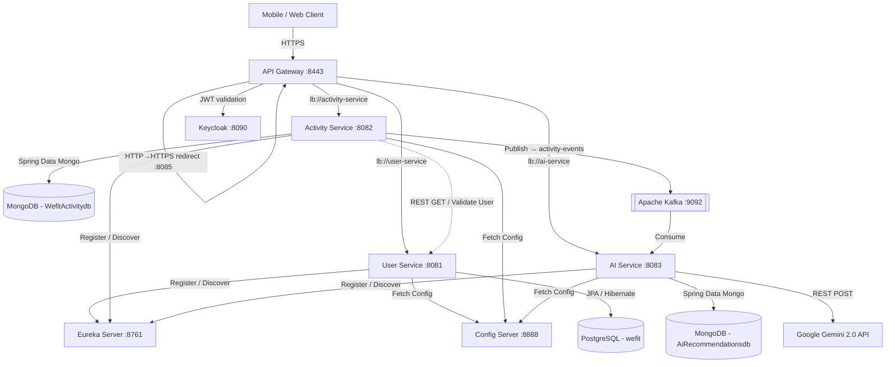

# 🏋️ Wefit — Complete Project Overview

> **Audience:** New engineers and interns joining the Wefit team.
> **Author:** Principal Software Engineer.
> **Last Updated:** 2026-09-19.
> **Auto-Update Policy:** This document is automatically updated by our AI agent workflow at the end of every Jira ticket. See [Auto-Update Policy](#-auto-update-policy) for details.

---

## Table of Contents

1. [What is Wefit?](#-what-is-wefit)
2. [The Vision](#-the-vision)
3. [Tech Stack Summary](#-tech-stack-summary)
4. [System Architecture](#-system-architecture)
5. [Service Index](#-service-index)
6. [Inter-Service Communication](#-inter-service-communication)
7. [Security & Authentication](#-security--authentication)
8. [Configuration Management](#-configuration-management)
9. [Environment Variables](#-environment-variables)
10. [TLS / Certificate Management](#-tls--certificate-management)
11. [How to Run Locally](#-how-to-run-locally)
12. [End-to-End Request Walkthrough](#-end-to-end-request-walkthrough)
13. [Roadmap](#-roadmap)
14. [Auto-Update Policy](#-auto-update-policy)
15. [Per-Service Deep Dives](#-per-service-deep-dives)

---

## 🎯 What is Wefit?

Wefit is an **AI-powered social fitness platform** built on a Spring Cloud Microservices architecture. Users register, log workouts (running, cycling, yoga, etc.), and receive **instant, personalised training and nutrition recommendations** generated by Google's Gemini 2.0 AI. The system is fully event-driven — activities are published to Apache Kafka and consumed asynchronously by the AI Service, meaning the user gets their response without waiting for the AI to finish processing.

---

## 🌟 The Vision

The long-term goal is to evolve Wefit into a **social media fitness platform** where:

- Users share workouts in a **Fitness Feed** (like Instagram for fitness).
- Friends can follow, comment, and react to workout achievements.
- **Group Challenges** with real-time leaderboards drive engagement.
- AI-generated training plans and nutritional tips can be shared directly to the feed.
- **Coaches** can review client logs and offer feedback within the platform.

---

## 🛠️ Tech Stack Summary

| Layer                  | Technology                                   | Version      |
|------------------------|----------------------------------------------|-------------|
| Language               | Java                                         | 21           |
| Framework              | Spring Boot                                  | 4.0.6        |
| Cloud Toolkit          | Spring Cloud (Config, Gateway, Eureka)       | Latest       |
| Relational DB          | PostgreSQL (with Flyway)                     | 15+          |
| NoSQL DB               | MongoDB                                      | 7+           |
| Message Broker         | Apache Kafka                                 | 3.x          |
| AI / LLM               | Google Gemini API (`gemini-2.0-flash`)        | v1beta       |
| Authentication / IdP   | Keycloak (OAuth2 / OIDC)                     | 24+          |
| JWT Parsing            | Nimbus JOSE+JWT                              | —            |
| Build Tool             | Maven                                        | 3.9+         |
| Boilerplate Reduction  | Lombok                                       | Latest       |
| Serialisation          | Jackson (JSON)                               | —            |
| TLS Certificates       | Java Keytool / OpenSSL (PKCS12)              | —            |

---

## 📐 System Architecture



### Startup Order (Critical)
Services **must** start in this order due to dependency chains:

1. **Eureka Server** — All services register here.
2. **Config Server** — All services fetch their `application.yml` from here.
3. **User Service** — Needed by Activity Service for user validation.
4. **Activity Service** — Needed by AI Service (produces Kafka events).
5. **AI Service** — Consumes Kafka events.
6. **API Gateway** — Routes to all above services.

---

## 📂 Service Index

| Service           | Port  | Spring Name        | Database                     | Role                                    |
|-------------------|-------|--------------------|------------------------------|-----------------------------------------|
| Eureka Server     | 8761  | `eureka`           | None                         | Service discovery registry              |
| Config Server     | 8888  | `config-server`    | None (filesystem-backed)     | Centralised configuration server        |
| API Gateway       | 8443 (HTTPS) / 8085 (HTTP redirect) | `api-gateway` | None | Reverse proxy, routing, auth, user sync |
| User Service      | 8081  | `user-service`     | PostgreSQL (`wefit`)         | User registration, profiles, validation |
| Activity Service  | 8082  | `activity-service` | MongoDB (`WefitActivitydb`)  | Workout logging, Kafka producer         |
| AI Service        | 8083  | `ai-service`       | MongoDB (`AiRecommendationsdb`) | Kafka consumer, Gemini AI integration  |

> **Detailed technical documentation for each service** is in the `/project/services/` folder. Links:
> - [Eureka Server](./services/eureka.md)
> - [Config Server](./services/config_server.md)
> - [API Gateway](./services/api_gateway.md)
> - [User Service](./services/user_service.md)
> - [Activity Service](./services/activity_service.md)
> - [AI Service](./services/ai_service.md)

---

## 🔄 Inter-Service Communication

### Synchronous (REST / WebClient)

| Caller            | Callee           | Endpoint                                  | Purpose                             |
|-------------------|------------------|--------------------------------------------|-------------------------------------|
| Activity Service  | User Service     | `GET /api/user/auth/{userId}/validate`     | Validate user exists before logging an activity |
| API Gateway       | User Service     | `GET /api/users/keycloak/{keycloakId}`     | Look up user by Keycloak ID during JWT sync |
| API Gateway       | User Service     | `POST /api/users/register`                 | Auto-register user from Keycloak JWT if not found |
| AI Service        | Gemini API       | `POST {geminiUrl}?key={apiKey}`            | Generate AI recommendation from structured prompt |

### Asynchronous (Kafka)

| Producer          | Topic              | Consumer       | Payload                | Purpose                                      |
|-------------------|--------------------|----------------|------------------------|----------------------------------------------|
| Activity Service  | `activity-events`  | AI Service     | `Activity` JSON object | Trigger AI recommendation generation         |

**Kafka Serialisation:**
- **Producer** (Activity Service): `StringSerializer` (key) + `JsonSerializer` (value). Type headers are disabled (`spring.json.add.type.headers: false`).
- **Consumer** (AI Service): `StringDeserializer` (key) + `JsonDeserializer` (value). Trusted packages set to `*`. Default type is `com.wefit.aiService.entities.Activity`. Consumer group: `activity-processor-group`.

---

## 🔒 Security & Authentication

### OAuth2 / Keycloak Integration

1. **Keycloak** runs at `http://localhost:8090` with a realm called `wefit`.
2. The **API Gateway** is configured as an OAuth2 Resource Server. Every incoming request (except `/actuator/**`) must carry a valid JWT `Bearer` token.
3. The gateway validates JWTs using the Keycloak JWK Set URI: `http://localhost:8090/realms/wefit/protocol/openid-connect/certs`.
4. The `SecurityConfiguration` class (WebFlux Security) enforces this:
   - `csrf` is disabled.
   - `pathMatchers("/actuator/**").permitAll()` — actuator endpoints are public.
   - `anyExchange().authenticated()` — everything else requires a valid JWT.

### Automatic User Sync (KeyCloakUserSyncFilter)

The gateway has a custom `WebFilter` (`KeyCloakUserSyncFilter`, order = 1) that runs **before** routing:

1. Extracts the JWT from the `Authorization` header.
2. Parses it using `nimbus-jose-jwt` (no Spring Security context needed) to get: `sub` (Keycloak ID), `email`, `given_name`, `family_name`, `preferred_username`.
3. Calls `GET /api/users/keycloak/{keycloakId}` on User Service.
4. If user **not found** (404), it auto-registers them via `POST /api/users/register` with `password = "KEYCLOAK_MANAGED"`.
5. Adds two headers to the downstream request: `X-User-Id` (internal Long ID) and `X-User-Keycloak-Id`.

### Password Hashing
User Service hashes passwords with `BCryptPasswordEncoder` before persisting to PostgreSQL.

---

## ⚙️ Configuration Management

### How It Works

1. Each service's local `application.yml` contains only two things:
   - `spring.application.name` (e.g., `user-service`)
   - `spring.config.import: optional:configserver:http://localhost:8888`
2. On startup, the service contacts the **Config Server** with its application name.
3. The Config Server reads from `configServer/src/main/resources/config/{service-name}.yml` and returns the full configuration.
4. This centralises all DB passwords, Kafka URLs, Eureka zones, SSL certs, etc.

### Config File Locations (inside Config Server)

| File                        | Serves             | Key Properties                                                       |
|-----------------------------|---------------------|----------------------------------------------------------------------|
| `config/user-service.yml`   | User Service        | PostgreSQL URL/creds, JPA settings, Eureka zone, SSL keystore, port 8081 |
| `config/activity-service.yml` | Activity Service | MongoDB URI, Kafka bootstrap servers, Kafka topic name, User Service base URL, port 8082 |
| `config/ai-service.yml`     | AI Service          | MongoDB URI, Kafka consumer settings, Gemini API URL/key, port 8083  |
| `config/api-gateway.yml`    | API Gateway         | Gateway routes, Keycloak JWK URI, Eureka zone, logging levels, SSL, port 8443 |

---

## 🔑 Environment Variables

All secrets and environment-specific values are injected via the `.env` file in the project root. The `.env.example` file documents every required variable:

| Variable                          | Used By             | Purpose                                              |
|-----------------------------------|---------------------|------------------------------------------------------|
| `DB_URL_USER_SERVICE`             | User Service        | JDBC URL for PostgreSQL (`jdbc:postgresql://...`)    |
| `DB_USERNAME`                     | User Service        | PostgreSQL username                                  |
| `DB_PASSWORD`                     | User Service        | PostgreSQL password                                  |
| `MONGODB_URI_ACTIVITY_SERVICE`    | Activity Service    | MongoDB connection string                            |
| `MONGODB_DATABASE_ACTIVITY_SERVICE` | Activity Service  | MongoDB database name                                |
| `MONGODB_URI_AI_SERVICE`          | AI Service          | MongoDB connection string                            |
| `MONGODB_DATABASE_AI_SERVICE`     | AI Service          | MongoDB database name                                |
| `KAFKA_BOOTSTRAP_SERVERS`         | Activity & AI       | Kafka broker address                                 |
| `KAFKA_TOPIC_NAME`               | Activity & AI       | Kafka topic name (default: `activity-events`)       |
| `KAFKA_CONSUMER_GROUP_ID`         | AI Service          | Kafka consumer group                                 |
| `EUREKA_DEFAULT_ZONE`            | All services        | Eureka registry URL                                  |
| `GEMINI_URL`                      | AI Service          | Google Gemini API endpoint URL                       |
| `GEMINI_API_KEY`                  | AI Service          | Google Gemini API key                                |
| `KEYCLOAK_CERTS_URL`             | API Gateway         | Keycloak JWK Set URI for JWT validation              |
| `REDIS_HOST`                      | API Gateway         | Redis host for rate limiting                         |
| `REDIS_PORT`                      | API Gateway         | Redis port for rate limiting                         |

---

## 🔐 TLS / Certificate Management

All services communicate over **HTTPS** using TLS certificates stored in PKCS12 keystores.

- **Local Development:** Run `generate-certs.bat` (Windows) or `generate-certs.sh` (Linux/Mac) to generate a self-signed certificate in the `certs/` directory using Java's `keytool`. Valid for 10 years.
- **Production:** Use managed certificates (AWS ACM, Let's Encrypt via `certbot`). Convert PEM to PKCS12 using OpenSSL. Automate renewal with cron + post-hook.
- **Keystore Config** (in every service's config): `key-store: file:../certs/keystore.p12`, password `changeit`, type `PKCS12`, alias `wefit`.

See [CERTIFICATE_MANAGEMENT.md](../CERTIFICATE_MANAGEMENT.md) for the full strategy.

---

## 🚀 How to Run Locally

### Prerequisites
- **Java 21** + **Maven 3.9+**
- **PostgreSQL** running, with a database named `wefit` created.
- **MongoDB** running on port `27017`.
- **Apache Kafka** running on port `9092` (with KRaft or Zookeeper).
- **Keycloak** running on port `8090` with a `wefit` realm configured.
- Certificates generated (`generate-certs.bat`).

### Steps
1. Copy `.env.example` to `.env` and fill in your secrets.
2. Run `start-services.bat` (Windows) or `python start_services.py` (cross-platform).
3. Services start sequentially: Eureka → Config Server → User Service → Activity Service → AI Service → API Gateway.
4. Access the Eureka dashboard at `https://localhost:8761` to verify all services are registered.

---

## 🧪 End-to-End Request Walkthrough

Here is what happens when a user logs a workout, step by step:

```
1. Client sends POST /api/activities/add with JWT Bearer token
   ↓
2. API Gateway (port 8443) receives the request
   ↓
3. SecurityConfiguration validates the JWT against Keycloak JWK
   ↓
4. KeyCloakUserSyncFilter:
   a. Parses JWT → extracts keycloakId, email, name
   b. GET /api/users/keycloak/{keycloakId} → User Service
   c. If 404 → POST /api/users/register (auto-register)
   d. Adds X-User-Id header
   ↓
5. Gateway routes to Activity Service (lb://activity-service)
   matching Path=/api/activities/**
   ↓
6. ActivityController.addActivity() receives ActivityRequestDto
   ↓
7. ActivityService.addActivity():
   a. Calls UserValidationService.validateUser(userId)
      → GET /api/user/auth/{userId}/validate on User Service
      → Returns true/false
   b. If invalid → throws RuntimeException("Invalid user")
   c. Converts DTO → Activity entity
   d. Saves to MongoDB (WefitActivitydb, "Activities" collection)
   e. Publishes Activity to Kafka topic "activity-events"
   f. Returns ActivityResponseDto
   ↓
8. Kafka delivers message to AI Service consumer group
   ↓
9. ActivityMessageListener.listen(Activity):
   a. Logs receipt
   b. Calls ActivityAiService.generateRecommendation(activity)
   ↓
10. ActivityAiService:
    a. Creates structured prompt with activity details
    b. Calls GeminiService.getRecommendations(prompt)
       → POST to Gemini API with JSON body
    c. Parses Gemini's JSON response:
       - Strips markdown code fences (```json ... ```)
       - Extracts analysis.overall, improvements[], suggestions[], safety[]
    d. Builds Recommendation entity
    e. Saves to MongoDB (AiRecommendationsdb, "ai_recommendations" collection)
    f. On failure → saves a fallback recommendation
   ↓
11. Client can later fetch: GET /api/recommendations/user/{userId}
    → Returns top 5 recommendations, ordered by createdAt DESC
```

---

## 🗺️ Roadmap

| Feature                              | Status    | Description                                                        |
|--------------------------------------|-----------|--------------------------------------------------------------------|
| Feed Service                         | 🔲 Planned | Timeline generation, posts, likes, comments, activity shares       |
| Relationship Service                 | 🔲 Planned | Follow networks (following/followers graph)                        |
| Real-time Notifications              | 🔲 Planned | WebSocket/SSE for friend activity alerts, comments, likes          |
| Gamification & Leaderboards          | 🔲 Planned | Batch processing for leaderboard scores                            |
| Mobile/Frontend Client               | 🔲 Planned | Next.js or React Native UI                                        |

---

## 📜 Auto-Update Policy

This document and the per-service documents in `project/services/` are kept up-to-date **automatically** by our AI agent workflow.

**How it works:**
- Our development workflow uses the `jira-ticket-flow` skill (located at `.agents/skills/jira-ticket-flow/SKILL.md`).
- Step 7 of that workflow (**"Update Project Documentation (MANDATORY)"**) requires that before any code is committed, the agent reviews and updates:
  1. This file (`project/Wefit_Project_Overview.md`) — for architectural, cross-cutting, or infrastructure changes.
  2. The relevant service document in `project/services/` — for any service-specific code changes (new endpoints, entity changes, config changes, etc.).

**What gets updated:**
- New services, endpoints, or database changes.
- Changes to environment variables or configuration.
- New inter-service communication patterns.
- Security or authentication changes.
- Any other architectural modification.

---

## 📖 Per-Service Deep Dives

Detailed technical documentation for each service lives in the `project/services/` folder:

| Service          | Document                                        |
|------------------|-------------------------------------------------|
| Eureka Server    | [eureka.md](./services/eureka.md)               |
| Config Server    | [config_server.md](./services/config_server.md) |
| API Gateway      | [api_gateway.md](./services/api_gateway.md)     |
| User Service     | [user_service.md](./services/user_service.md)   |
| Activity Service | [activity_service.md](./services/activity_service.md) |
| AI Service       | [ai_service.md](./services/ai_service.md)       |

Each document covers: purpose, directory structure, every Java class, entity schemas, DTO mappings, endpoint specifications, configuration, database details, and design decisions.
